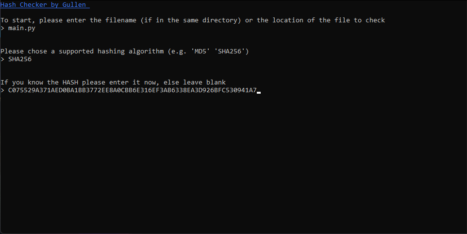
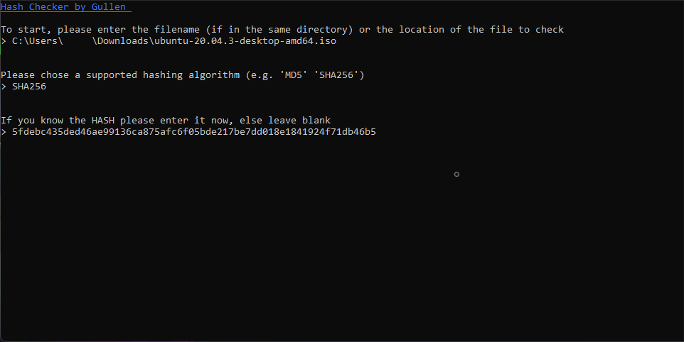
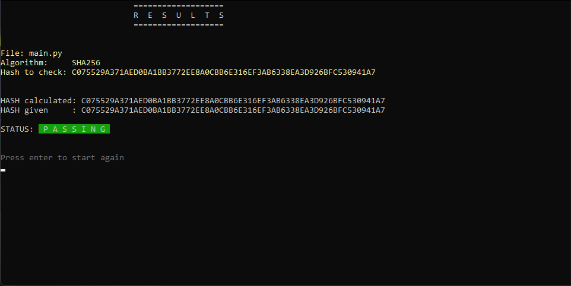
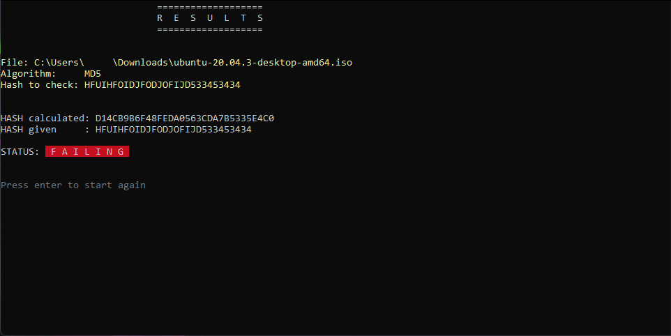

# HashChecker 

Verify your downloads or any other hash using this simple script.

*Note: currently only supporting Windows.*

**Current Version: v1.0.1**

* HashChecker.exe
MD5: ```97CAA8991696BBA0986E326D7F283E76```
SHA256: ```B65F4964E9E5339A3C5A43F43F91C5EABFC719E063CEFAB423CEF87187DAAE9A```

* HashChecker.py
MD5: ```8B18BB6C48438BE0E000A0F7D0238020```
SHA256: ```52B49A94844FAE326F9387A415617820CBB4415A056A7E3DCAEE49D3D14C4C52```

## Currently supported hashing algorithms

* MD5
* SHA256

### Using the program
The program will ask you for the filename (if the script is in the same directory) or the location of the file to be hashed.

You then will be asked for an algorithm to choose, see above for currently supported algorithms.

Lastly you will be asked if you have a hash you are expecting / want to check against.




You will then be presented with a screen showing you all the information you chose and the result of the program, whether the hashes match or not.




Great way to test the program is to check the hashes given above.