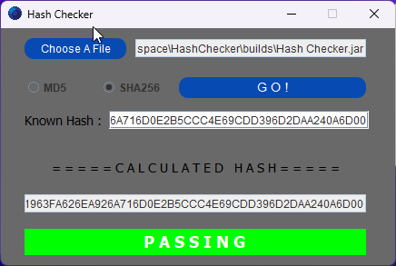

# HashChecker 
Verify your downloads or any other hash using this simple script.

**Current Version: v2.0.0.0**
* HashChecker.exe \
MD5: ```F6DE74E535134159BAC7A2CE348A01E0``` \
SHA256: ```468E7A9A9475C8B7D0608B502F57B8099A57B476296E743D4635D96DB4F17CD3```
* HashChecker.jar \
MD5: ```39417895C8CAD332269D29A9FDAC9B4D``` \
SHA256: ```9F65A8B9585C5B1963FA626EA926A716D0E2B5CCC4E69CDD396D2DAA240A6D00```
##### Please note HashChecker.exe only supports **<u>Windows</u>** whereas HashChecker.jar will support any <u>OS with Java instsalled</u>. 

### <ins>Malware protection<ins/>
#### Please see the below links for the results of a malware scan of both files.
* HashChecker.exe
```https://www.virustotal.com/gui/file/468e7a9a9475c8b7d0608b502f57b8099a57b476296e743d4635d96db4f17cd3?nocache=1```
* HashChecker.jar
```https://www.virustotal.com/gui/file/9f65a8b9585c5b1963fa626ea926a716d0e2b5ccc4e69cdd396d2daa240a6d00?nocache=1```

## Currently supported hashing algorithms
* MD5
* SHA256

### Using the program
To use the program you just need to choose a file, an algorithm and click go!

To select a file use the respective button and use the file picker to select your desired file.

Depending on which algorithm you want to use, select the corrisponding button.

If you know what the hash should be, copy and paste it into the "Known Hash" field.

Click go!

The program will output the hash for the selected file, and tell you if the "Known Hash" (if filled) is correct or not.

### Unknown Hash


### Incorrect Hash


### Correct Hash


## Legacy version
To view and run the legacy version of HashChecker please view the [readme](https://github.com/Gullen/HashChecker/blob/main/legacy/README.md) in the legacy folder.

* Legacy versions are: **1.x.x**


